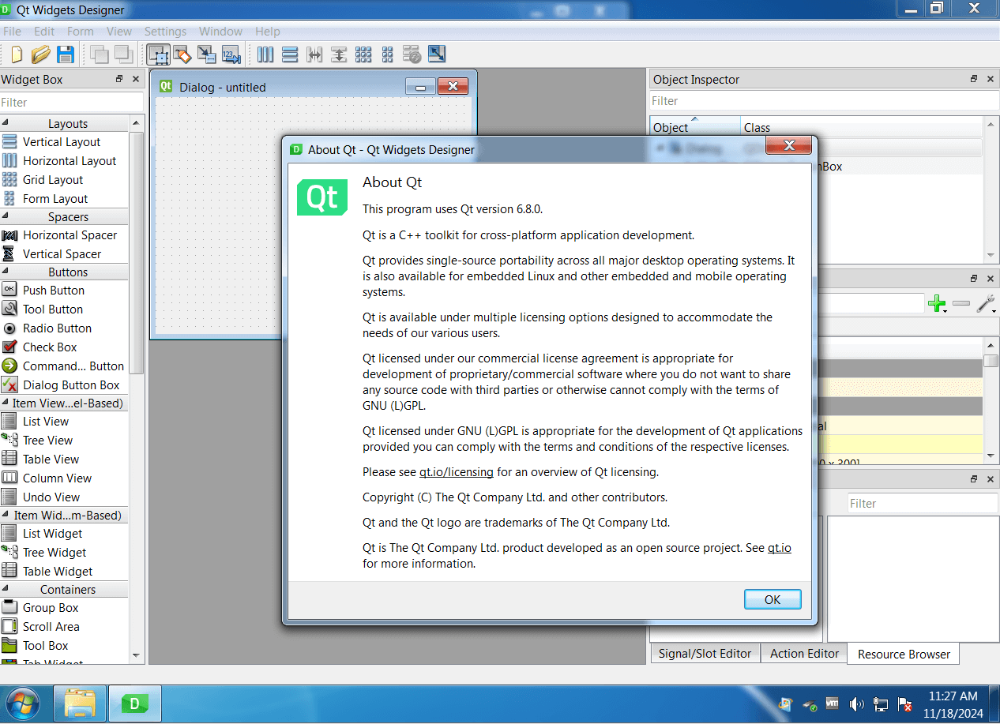

This repository provides a backport of the Qt 6 qtbase module, tailored for compatibility with Windows 7, 8 and 8.1. It contains patched source files from the qtbase module, along with some additional required files. To apply the backport, simply copy the contents of the src folder into your qtbase/src directory, replacing the existing files.

The most recent supported version is **6.8.3** however many older versions are supported as well (see **Older versions** section).

This approach builds upon the methodology discussed in this forum [thread](https://forum.qt.io/topic/133002/qt-creator-6-0-1-and-qt-6-2-2-running-on-windows-7/60) but offers significant enhancements, including important fallbacks to the default Qt 6 behavior when running on newer versions of Windows.

You can compile it yourself using your preferred compiler and build options or can use our [compile_win.pl](https://github.com/crystalidea/qt-build-tools/tree/master/6.8.1) build script, which utilizes Visual C++ 2022 and includes OpenSSL 3.0.13 statically linked. Alternatively, you can download our [prebuild Qt dlls](https://github.com/crystalidea/qt6windows7/releases), which also include the Qt Designer binary for demonstration purposes.

**Qt 6.8.3 designer running on Windows 7**:

**Other modules**:

Many of other Qt 6 modules are known to work fine on Windows 7 without modifications when compiled with patched qtbase. Verified modules:

- qt5compat
- qtimageformats
- qttools
- ... please let me know which work and which don't !

### Known issues:

- QRhi using DirectX 11/12 is not ported

### Older versions:

- [Qt 6.8.2](https://github.com/crystalidea/qt6windows7/releases/tag/v6.8.2)
- [Qt 6.8.1](https://github.com/crystalidea/qt6windows7/releases/tag/v6.8.1)
- [Qt 6.8.0](https://github.com/crystalidea/qt6windows7/releases/tag/v6.8.0)
- [Qt 6.7.2](https://github.com/crystalidea/qt6windows7/releases/tag/v6.7.2)
- [Qt 6.6.3](https://github.com/crystalidea/qt6windows7/releases/tag/v6.6.3)
- [Qt 6.6.2](https://github.com/crystalidea/qt6windows7/releases/tag/v6.6.2)
- [Qt 6.6.1](https://github.com/crystalidea/qt6windows7/releases/tag/v6.6.1)
- [Qt 6.6.0](https://github.com/crystalidea/qt6windows7/releases/tag/v6.6.0)
- [Qt 6.5.3](https://github.com/crystalidea/qt6windows7/releases/tag/6.5.3-win7)
- [Qt 6.5.1](https://github.com/crystalidea/qt6windows7/releases/tag/6.5.1-win7)

### License

The repository shares Qt Community Edition terms which imply [Open-Source terms and conditions (GPL and LGPL)](https://www.qt.io/licensing/open-source-lgpl-obligations?hsLang=en).
