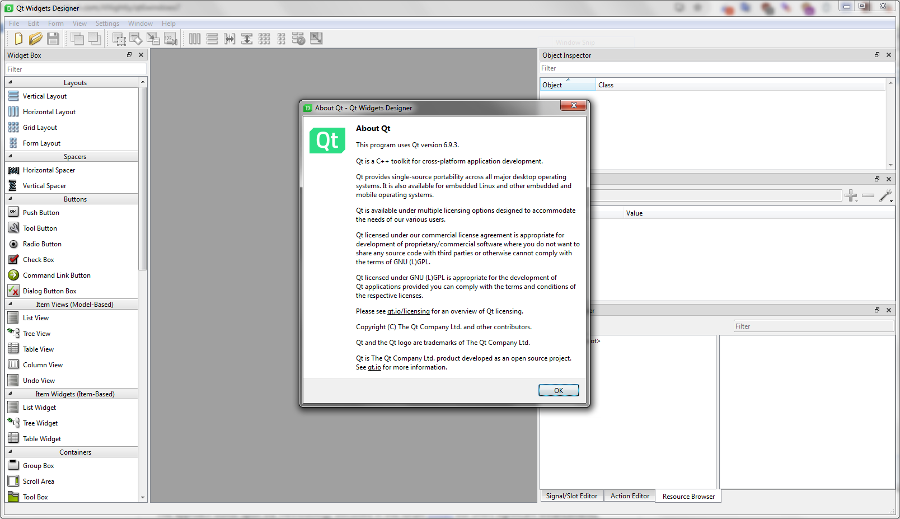

This repository provides a backport of Qt 6, tailored for compatibility with Windows 7, 8 and 8.1. It contains patched source files, along with some additional required files.

Each top-level folder here mirrors one Qt repository: apply a patch set by copying the contents of that folder over your checkout of the same name, replacing the existing files. `qtbase` is the backport proper and is always needed; `qtmultimedia` and `qtwebengine` are only needed if you build those modules. Every module is covered in its own section below.

The most recent supported version is **6.8.4** however many older versions are supported as well (see **Older versions** section).

This approach builds upon the methodology discussed in this forum [thread](https://forum.qt.io/topic/133002/qt-creator-6-0-1-and-qt-6-2-2-running-on-windows-7/60) but offers significant enhancements, including important fallbacks to the default Qt 6 behavior when running on newer versions of Windows.

You can compile it yourself using your preferred compiler and build options or can use our [compile_win.pl](https://github.com/crystalidea/qt-build-tools/tree/master/6.8.1) build script, which utilizes Visual C++ 2022 and includes OpenSSL 3.0.13 statically linked. Alternatively, you can download our [prebuild Qt dlls](https://github.com/crystalidea/qt6windows7/releases), which also include the Qt Designer binary for demonstration purposes.

**Qt 6.8.4 designer running on Windows 7**:



### qtbase

The backport proper, and the part everything else on this page assumes is in place. Stock Qt 6 imports a good number of Windows 8/8.1/10 entry points statically, so it cannot even be loaded on Windows 7. Nearly every patch here follows the same recipe: look the function up with `GetProcAddress()` at run time and fall back to the older API when it is missing, so that newer Windows keeps taking exactly the path it took before.

**corelib**

- `io/qstandardpaths_win.cpp` — low-integrity process detection is a Windows 8 concept; report false on Windows 7 instead. Also fixes the buffer-size probe of `GetTokenInformation()`.
- `kernel/qeventdispatcher_win.cpp` — `SetCoalescableTimer()`, falling back to plain `SetTimer()`.
- `kernel/qfunctions_win.cpp` — `GetCurrentPackageFullName()`; without it the process is simply not a packaged app.
- `thread/qfutex_p.h`, `thread/qmutex.cpp`, `thread/qmutex_p.h`, `thread/qmutex_win.cpp` (new) — the futex path uses `WaitOnAddress()` (Windows 8), so it is disabled and `QMutex` gets an event-based Windows implementation instead.
- `thread/qthread_win.cpp` — `SetThreadDescription()` (Windows 10) for thread names, falling back to the classic debugger exception.

**gui**

- `rhi/qrhid3d11.cpp`, `rhi/qrhid3d11_p.h` — `CreateDXGIFactory2()` (Windows 8), plus a separate swapchain path for Windows 7. Which of the two swapchain paths is taken is decided with `QOperatingSystemVersion` rather than `IsWindows10OrGreater()`, deliberately: see **The version an application is told** below.
- `rhi/qrhid3d12.cpp` — `CreateDXGIFactory2()`, `D3D12CreateDevice()` and `D3D12GetDebugInterface()`; when they are absent the D3D12 backend just reports itself unavailable.
- `text/windows/qwindowsfontdatabasebase.cpp` — `SystemParametersInfoForDpi()` (Windows 10), falling back to `SystemParametersInfo()`.
- `text/windows/qwindowsfontenginedirectwrite.cpp` — not an import but a per-glyph cost. `imageForGlyph()` asks for `IDWriteFactory2` (Windows 8.1) and already falls back to the DirectWrite 1 glyph run analysis when it is absent, so text renders correctly on Windows 7 either way — but it also called `qErrnoWarning()` on **every glyph**, which buries every other message in the log and pays for a `FormatMessage()` per character drawn. Said once now, as debug output. The identical query in `alphaMapBoundingBox()` never warned and is left alone.

**network**

- `kernel/qdnslookup_win.cpp` — `DnsQueryEx()` (Windows 8); the older `DnsQuery()` path is restored for Windows 7.

**platform plugin (windows)**

- `vxkex.h` (new) — Windows 7 stand-ins for the per-monitor DPI helpers (`GetSystemMetricsForDpi()`, `AdjustWindowRectExForDpi()` and friends), which simply scale the DPI-unaware originals.
- `qwindowscontext.h`, `qwindowscontext.cpp` — the central place where the optional user32/shcore entry points are resolved: the pointer input API (Windows 8), the per-DPI metrics and the shcore DPI awareness calls (Windows 8.1/10). The rest of the plugin asks this struct instead of calling the imports directly.
- `qwindowsdrag.cpp`, `qwindowskeymapper.cpp`, `qwindowspointerhandler.cpp`, `qwindowsscreen.cpp`, `qwindowswindow.cpp`, `qwindowsintegration.cpp` — use those resolved pointers, with the `vxkex.h` fallbacks where a DPI-aware metric is needed.
- `qwindowstheme.cpp` — accent colours come from WinRT `UISettings` on Windows 10; on Windows 7 the palette falls back to the system colours.
- `qwin10helpers.cpp` — loads `combase.dll` dynamically instead of importing it, so the WinRT helpers degrade gracefully when it is not there.
- `uiautomation/qwindowsuiawrapper_p.h`, `qwindowsuiawrapper.cpp` (new), `qwindowsuiamainprovider.cpp`, `qwindowsuiaaccessibility.cpp` — accessibility goes through a wrapper that resolves the UI Automation entry points at run time, since Windows 7 ships an older `uiautomationcore.dll`.

**widgets**

- `styles/qwindowsstyle.cpp` — the same per-DPI metric helpers as above, via `vxkex.h`.

One more file completes the set: `corelib/platform/windows/qt_winrtbase_p.h` resolves the C++/WinRT entry points (`RoGetActivationFactory()` and friends) through `combase.dll` at run time. Without it the WinRT imports alone keep the process from starting on Windows 7 — and because other modules compile against this header too, it is what lets qtmultimedia use WinRT without extra patches of its own.

### qtmultimedia

Playing media needs both the FFmpeg plugin, which would not load at all, and the WASAPI audio backend, which could not open a device and then crashed on shutdown. Four patches are provided in the `qtmultimedia` folder.

The first two concern the WinRT window capture support, compiled in whenever the `cpp_winrt` feature is enabled. Without them the plugin cannot be loaded on Windows 7, which leaves Qt Multimedia without a backend — `QMediaPlayer` reports itself unavailable and nothing plays.

- `src/plugins/multimedia/ffmpeg/CMakeLists.txt`

  The plugin linked `WindowsApp.lib`, the UWP umbrella import library. Linking it makes every plain kernel32 function resolve through `api-ms-win-core-*` API sets instead of KERNEL32.dll, and several of those sets only exist from Windows 8 onwards (`libraryloader-l1-2-0` is Windows 8.1; `synch-l1-2-0`, `localization-l1-2-0`, `heap-l2-1-0` and `processthreads-l1-1-1` are Windows 8), so the plugin cannot be loaded on Windows 7 at all. Every other Qt module imports KERNEL32.dll directly. Nothing is lost by dropping it: the WinRT entry points the plugin needs are resolved at run time through the `qt_winrtbase_p.h` replacement from the qtbase part of this backport, which `qffmpegwindowcapture_uwp.cpp` picks up via `qfactorycacheregistration_p.h`, so no static WinRT imports are left and `WindowsApp.lib` was only acting as the kernel32 umbrella.

- `src/plugins/multimedia/ffmpeg/qffmpegwindowcapture_uwp.cpp`

  The same plugin statically imports `CreateDirect3D11DeviceFromDXGIDevice` from d3d11.dll, and that export was only added in Windows 8.1. d3d11.dll itself is available on Windows 7 SP1 with the Platform Update (KB2670838, which patched qtbase needs anyway), so the module is found and just this one export is missing — enough to make the whole plugin unloadable with `ERROR_PROC_NOT_FOUND`. The function only hands a D3D11 device to the WinRT capture API, so the entire media backend was being lost for a feature unrelated to playback. The patch resolves it at run time: nothing changes on Windows 8.1 and later, while on Windows 7 only window capture fails, through the same `hresult` error path its callers already handle.

Both keep the `cpp_winrt` feature enabled, so WinRT window capture is still built and behaves exactly as before on Windows 8.1 and later; only the two Windows 8-and-later dependencies are moved from load time to run time. Configuring Qt with `-no-feature-cpp-winrt` would sidestep both problems without patching qtmultimedia, but it drops the feature everywhere, including on the newer Windows versions where it works — which is what this backport exists to avoid.

Audio needs the WASAPI backend. `createAudioClient()` activates `IAudioClient3`, an interface that only exists from Windows 10 on, so on Windows 7 activation fails and no audio device can be opened at all — and worse, `openAudioClient()` then leaves the audio client empty while the stream object lives on, so `QWASAPIAudioSinkStream::stop()` still called `audioClientStop()` on it and crashed the application with an access violation as soon as playback was closed.

- `src/multimedia/windows/qwindowsaudioutils.cpp`, `qwindowsaudioutils_p.h`, `qwindowsaudiosink_p.h`, `qwindowsaudiosource_p.h`

  The audio client is now held as the base `IAudioClient`, which has been around since Vista and carries every method the playback and capture paths actually use. `createAudioClient()` still asks for `IAudioClient3` first, so on Windows 10 and later the very same object is obtained as before and nothing changes there; only when that fails does it fall back to `IAudioClient`. Setting the endpoint role goes through `IAudioClient2::SetClientProperties` and is therefore skipped when only the base interface is available — on Windows 7 the role stays at its default. The `audioClientStart/Stop/Reset()` helpers additionally return false on an empty client instead of dereferencing it, which is what their callers already expect from a failed call and which fixes the crash on close. Both playback and capture go through these helpers, so both are covered.

Verified with Qt 6.8.4: video plays with sound on Windows 7 SP1.

### qtwebengine (Qt WebEngine and Qt PDF)

Neither module works on Windows 7 out of the box, even with patched qtbase. Qt PDF needs the two patches described at the end of this section; Qt WebEngine needs those plus the rest of the `qtwebengine` folder.

The reason there is so much to do here is that Chromium dropped Windows 7 and 8 in M110, and Qt 6.8 carries Chromium 122. Almost every patch below is therefore not an invention but a restoration: the same file in Chromium 109.0.5414.120 — the last release that supported Windows 7 — resolved the entry point at run time or skipped it behind a version check, and M110 deleted that code. Each patch is marked in place with a `Windows 7 backport:` comment, and the handful of cases where 109 has no equivalent are called out below. As everywhere else in this repository, the fallback only engages when `GetProcAddress()` comes back empty, so Windows 8 and later keep taking exactly the path they take today.

**Loading the library at all**

Stock `Qt6WebEngineCore.dll` imports about thirty entry points that Windows 7 does not have, so it cannot be loaded there — and neither can `QtWebEngineProcess.exe`, `webenginedriver.exe` or `qwebengine_convert_dict.exe`, which pull the same code in statically. Whole API-set DLLs are involved, not just individual exports, and an absent API set is as fatal as an absent function.

- `base/win/core_winrt_util.cc`, `base/win/scoped_winrt_initializer.cc`, `base/win/scoped_hstring.cc`, `base/win/hstring_reference.cc` — the WinRT and HSTRING entry points (`RoInitialize()`, `RoGetActivationFactory()`, `WindowsCreateString()` and friends), imported through `api-ms-win-core-winrt-l1-1-0.dll` and `api-ms-win-core-winrt-string-l1-1-0.dll`. They are resolved out of `combase.dll` instead, which is the same code the API set forwards to on newer Windows. On Windows 7 they are simply missing, and the WinRT-backed features — Web Bluetooth, WinRT MIDI, WinRT geolocation, `UISettings` accent colours, the on-screen keyboard — return the failures their callers already handle. This mirrors what `qt_winrtbase_p.h` does for qtbase.
- `base/win/win_util.cc` — the same WinRT wrapper for tablet-mode detection, plus `GetProcessMitigationPolicy()` (Windows 8) and `SetProcessDpiAwareness()` (shcore, Windows 8.1). Where win32k syscalls cannot be disabled at all, user32 and gdi32 are by definition available; where shcore is absent, the existing `SetProcessDPIAware()` fallback runs, which is all Windows 7 offers.
- `base/time/time_win.cc` — `QueryUnbiasedInterruptTimePrecise()` (`api-ms-win-core-realtime-l1-1-1.dll`, Windows 10), falling back to `QueryUnbiasedInterruptTime()`, in kernel32 since Windows 7. Same clock, same 100 ns units, same unbiased semantics — only tick resolution instead of interpolated. This one has no 109 equivalent: `LiveTicks` did not exist yet.
- `base/power_monitor/speed_limit_observer_win.cc`, `third_party/crashpad/crashpad/snapshot/win/system_snapshot_win.cc` — `CallNtPowerInformation()`, which current SDKs route through `api-ms-win-power-base-l1-1-0.dll`. It is loaded from `powrprof.dll`, where it has lived since Windows XP and where the API set forwards to anyway.
- `base/power_monitor/power_monitor_device_source_win.cc` — `RegisterSuspendResumeNotification()` (Windows 8). On Windows 7 registration is not needed at all: `WM_POWERBROADCAST`/`PBT_APMSUSPEND` reaches every top-level window, and registering is only required for modern-standby machines, which is exactly what the comment above the call says.
- `base/memory/discardable_shared_memory.cc`, `base/allocator/.../page_allocator_internals_win.h` — `DiscardVirtualMemory()` (Windows 8.1). The `VirtualAlloc(MEM_RESET)` fallback is already written directly below each call, because the function is buggy on Windows 10 SP0; v8 in the same source tree still resolves it this way.
- `base/files/file_util_win.cc` — `PrefetchVirtualMemory()` (Windows 8), falling back to the existing `PreReadFileSlow()`, which warms the same pages with a sequential read.
- `base/threading/platform_thread_win.cc`, `base/process/process_win.cc` — `SetThreadInformation()` and `SetProcessInformation()` (Windows 8). They configure thread memory priority and EcoQoS power throttling, neither of which exists on Windows 7; both call sites already treat failure as expected, one of them saying so in its own comment.
- `base/trace_event/trace_logging_minimal_win.cc` — `EventSetInformation()` (Windows 8), which attaches provider traits to an ETW provider. The call is documented in place as best-effort; Microsoft's own message-compiler output offers this very `GetProcAddress()` mode for pre-Windows 8 targets. `EventRegister()`/`EventWrite()` are unaffected, so tracing keeps working.
- `v8/src/libplatform/etw/etw-provider-win.h` — the same `EventSetInformation()`, reached from a completely different direction and easy to miss: v8 registers its ETW providers through the SDK's `TraceLoggingProvider.h`, whose `TraceLoggingRegister()` calls `TraceLoggingSetInformation()` to attach provider traits. Because Chromium targets Windows 10, the header compiles that into a direct call. Setting `TLG_HAVE_EVENT_SET_INFORMATION` to 2 before including it selects the SDK's own documented pre-Windows 8 behaviour — look the function up through `GetModuleHandleExW`/`GetProcAddress` and return an error when it is absent. TraceLogging is documented to work correctly without it, so providers keep registering and events keep being written. This header is the only place in the whole tree that includes `TraceLoggingProvider.h`, which is what makes the one-line fix sufficient.
- `media/midi/midi_manager_winrt.cc` — `CM_Get_DevNode_PropertyW()` (Windows 8). The WinRT MIDI backend is behind a feature that is disabled by default, and Windows 7 uses the winmm-based manager regardless.
- `services/proxy_resolver_win/winhttp_api_wrapper_impl.cc` — the asynchronous proxy resolution APIs (`WinHttpCreateProxyResolver()` and friends, Windows 8). `WindowsSystemProxyResolutionService::IsSupported()` already requires Windows 10 1607, so nothing reaches them; proxy resolution goes through `WinHttpGetIEProxyConfigForCurrentUser()` and PAC evaluation, both fine on Windows 7.
- `ui/display/win/screen_win.cc`, `third_party/webrtc/.../win/screen_capture_utils.cc` — `GetDpiForMonitor()` (shcore, Windows 8.1). Both callers already fall back to the system DPI, which on Windows 7 is not an approximation but the correct answer: per-monitor DPI does not exist there.
- `ui/gfx/win/d3d_shared_fence.cc`, `gpu/command_buffer/service/dxgi_shared_handle_manager.cc` — `CompareObjectHandles()`. This is the one function with no Windows 7 equivalent at all, since it wraps `NtCompareObjects()` and that kernel has no such call. Both uses need NT handles for D3D11 shared resources, i.e. Windows 8 and later, so they are unreachable on Windows 7; the fallbacks are conservative anyway — compare the handle values in one case, skip a consistency assertion in the other.
- `sandbox/win/src/process_mitigations.cc` — `GetProcessMitigationPolicy()`, `SetProcessMitigationPolicy()`, `SetDefaultDllDirectories()` and `SetThreadInformation()`, restored to the 109 arrangement together with its version gates. With the supported-mitigations mask reading back as zero, no mitigation attribute is attached when a child process is created, so the sandbox falls back to the restricted token, job object, alternate desktop and integrity level — precisely the profile Chromium used on Windows 7. The 32-bit `DWORD`-sized mitigation mask that Windows 7 expects comes back too; without it `UpdateProcThreadAttribute()` fails and no child process starts at all on x86. One genuine loss: `SetDefaultDllDirectories()` needs KB2533623 on Windows 7, and where that update is missing the DLL search-order hardening is skipped rather than the process refusing to start.
- `sandbox/win/src/app_container_base.cc` — `CreateAppContainerProfile()` and `DeriveAppContainerSidFromAppContainerName()` (Windows 8), loaded from `userenv.dll` at run time. Qt already disables AppContainer entirely (`sandbox/features.cc` returns false under `TOOLKIT_QT`), so this is purely about the import.

**Crashes that remain once it loads**

- `third_party/boringssl/src/crypto/rand_extra/windows.c`, `base/rand_util_win.cc`, `sandbox/policy/win/sandbox_warmup.cc`, `third_party/ipcz/src/reference_drivers/random.cc`

  Four more copies of the `bcryptprimitives!ProcessPrng` pattern already patched for Qt PDF, and each one is fatal on its own. The DLL exists on Windows 7 so `LoadLibraryW()` succeeds and only the export lookup fails, which the surrounding check turns into a deliberate abort. All four fall back to `RtlGenRandom()` (`advapi32!SystemFunction036`), which is what Chromium used before the switch and which is the same system DRBG. The switch away from it was made to avoid opening a handle to `\Device\KsecDD` in the renderer; on Windows 7 the sandbox warmup opens that handle before the token is lowered anyway, which is exactly what the untaken branch of that feature already did.

  The BoringSSL one is the copy that actually brings the browser down, and it is the easiest to overlook because it is the only one written in C rather than C++: `CRYPTO_sysrand()` is reached as soon as the network stack wants randomness, which is moments after the first page starts loading, and it calls plain `abort()` — not a `CHECK`, so it does not even leave the usual Chromium breakpoint behind, just `STATUS_FATAL_APP_EXIT` (`0x40000015`) raised from inside `ucrtbase`. In `base::RandBytes()` the same failure is the first random number anything asks for, and in the sandbox warmup it is every sandboxed process at startup, since the `WinSboxWarmupProcessPrng` feature is enabled by default. The ipcz copy is the nastiest in principle — it asserts with `ABSL_ASSERT`, which compiles to nothing in release builds and would leave a null function pointer to be called — but that file is not part of the current build and is patched defensively.

- `base/memory/platform_shared_memory_region_win.cc`

  Chromium puts an empty DACL on its shared memory sections so that a read-only region cannot be duplicated back into a writable one, and `Take()` verifies that with a `CHECK`: it tries `DuplicateHandle()` with `FILE_MAP_WRITE` and requires the outcome to match the region's declared mode. Windows before 8.1 **ignores the DACL on unnamed objects**, sections included, so on Windows 7 the read-only handle duplicates just fine, the verification disagrees with the mode and the `CHECK` takes the browser process down with a breakpoint (`0x80000003`) the first time a region changes hands — which is moments after the first page starts loading. Chromium handled this until 109.0.5414.120 by giving the section a random name below Windows 8.1, since a named object does get its DACL honoured; M110 deleted the block but left `std::u16string name;` and the `name.empty() ? nullptr : as_wcstr(name)` argument in place, so restoring it is a matter of filling that variable in again. Sections stay unnamed on Windows 8.1 and later, exactly as now.

- `base/task/thread_pool/thread_group.cc`

  A thread pool worker that asks for `WorkerEnvironment::COM_MTA` gets its apartment from `ScopedWinrtInitializer`, which calls `RoInitialize()` — and that lives in combase.dll, so with the WinRT patch above doing the honest thing and reporting failure, those workers ended up with **no apartment initialised at all**. Everything on them that needs COM then fails; the browser process survived it, since the check there is `DUMP_WILL_BE_CHECK` rather than a real `CHECK`, but the renderer did not, and the only visible symptom was the renderer dying at startup. Chromium chose between WinRT and plain COM by version until 109.0.5414.120 — `CoInitializeEx(COINIT_MULTITHREADED)` gives those workers exactly the MTA they asked for — and that choice is restored here. This one is worth remembering as a lesson in its own right: making an unavailable API fail gracefully is necessary but not sufficient, because somewhere else code may depend on it succeeding.

- `content/browser/renderer_host/dwrite_font_proxy_impl_win.cc`

  `DWriteFontProxyImpl::InitializeDirectWrite()` queried the factory for `IDWriteFactory2` and `IDWriteFactory3` and asserted both succeed, the comment reading "This should succeed since we only support >= Win10". On Windows 7 neither does — `IDWriteFactory2` arrived with Windows 8.1 and `IDWriteFactory3` with Windows 10 — and since `DCHECK` compiles out in release builds the empty `factory3_` travelled straight into `GetLocalFontCollection()` and faulted on its first virtual call, taking the browser process down as soon as a page needed fonts. Chromium up to 109.0.5414.120 took the collection from the base factory and said plainly that the two queries may fail on older DirectWrite; the patch restores that, keeping the newer path (and with it the side-loaded font support, which exists for tests) wherever `IDWriteFactory3` really is available. The other two uses of these members in the file were already safe: one checks `factory2_` for null, the other bails out when `IDWriteFontCollection1` cannot be obtained.

- `sandbox/win/src/win_utils.cc`

  Before a target lowers its token it closes the handles the policy tells it to, and to do that it first has to enumerate its own handle table. `GetCurrentProcessHandles()` asks `NtQueryInformationProcess()` for `ProcessHandleTable`, an information class that only exists from Windows 8.1 on — the file even says as much, declaring it as a value "not in PROCESS_INFO_CLASS". On Windows 7 the call returns `STATUS_INVALID_INFO_CLASS`, the function returns nothing, `CloseHandles()` fails and the target kills itself with `SBOX_FATAL_CLOSEHANDLES` — the same 7010 as above, reached by a completely different route, so both have to be fixed before a renderer will start. Chromium walked the table by hand on these systems until 109.0.5414.120, in a function called `GetCurrentProcessHandlesWin7()`: handle values are always a multiple of four, so it tries them in order until it has found as many live handles as the process reports, giving up after a hundred consecutive invalid ones. That function is restored here and used whenever the information class call fails, rather than behind a version check, so any other reason for failing also lands on a working path. One adjustment was needed against the original: `GetTypeNameFromHandle()` returned a bool and an out-parameter in 109 and returns `std::optional<std::wstring>` in 122.

- `sandbox/win/src/sandbox_policy_base.cc`

  The sandbox disconnects its targets from csrss.exe by closing the ALPC port handle to it. To leave the process usable afterwards it first destroys the heap it shares with csrss, and it finds that heap by walking the undocumented `_HEAP` structure at the hardcoded offsets in `sandbox/win/src/heap_helper.cc` — offsets that only describe the Windows 8 and later layout. On Windows 7 the search comes up empty, `CloseOpenHandles()` fails and the target executes `TerminateProcess(GetCurrentProcess(), SBOX_FATAL_CLOSEHANDLES)`, so **every renderer dies at startup with exit code 7010** and no page can ever be displayed. Chromium gated the whole thing on `GetVersion() >= WIN10` until 109.0.5414.120; restoring that check leaves csrss connected below Windows 10, which is how the sandbox always behaved there. Everything else — the restricted token, the job object, the alternate desktop and the integrity level — is unaffected. Rewriting the heap walk for the Windows 7 layout would be the wrong trade: those offsets are undocumented and vary between builds, and getting them wrong corrupts the heap of the process doing the walking.

- `sandbox/win/src/startup_information_helper.h`, `startup_information_helper.cc`, `target_process.cc`

  The job object is handed to the child through `PROC_THREAD_ATTRIBUTE_JOB_LIST`, an attribute that only exists from Windows 10 on. On Windows 7 `UpdateProcThreadAttribute()` rejects it, `BuildStartupInformation()` fails and **no renderer, GPU or utility process can be started at all**. Below Windows 10 the attribute is now left out and the still-suspended target is assigned with `AssignProcessToJobObject()` before it is resumed, which is how Chromium did it up to 109; `CREATE_BREAKAWAY_FROM_JOB` comes back for pre-Windows 8, where nested jobs do not exist. The only difference is that the process exists outside the job for the moment between creation and assignment, while suspended.

- `sandbox/policy/win/sandbox_win.cc`

  Three assumptions about Windows 8 or later live in this file, and one of them costs the renderer its life.

  `\Device\KsecDD` is the expensive one. Chromium closes the renderer's handle to that device immediately before lockdown, behind a feature that is enabled by default and that `sandbox/policy/features.cc` introduces as an "emergency off switch". On Windows 10 the close is free: randomness comes from `bcryptprimitives!ProcessPrng` and nothing goes near KsecDD again. On Windows 7 that export does not exist, so every one of the `ProcessPrng` sites above falls back to `advapi32!RtlGenRandom`, which is forwarded to `cryptbase.dll` — and cryptbase opens `\Device\KsecDD` exactly once, during the sandbox warmup, then holds that handle for the life of the process. Closing it makes every later call fail, and BoringSSL answers a failing `CRYPTO_sysrand()` with `abort()`. What you see is a renderer that exits with code 3, emits **not one line of log**, and does so about a second into the first page load — whenever something first asks for random bytes. The very same build with `QTWEBENGINE_DISABLE_SANDBOX=1` renders the page perfectly, which is what makes this one hard to place. Chromium 109 closed no such handle: it warmed the RNG with `rand_s()` under the comment "Cause advapi32 to load before the sandbox is turned on" and left the handle alone. The close is now gated on Windows 10, where the assumption behind it actually holds. It can also be switched off from outside, without rebuilding, which is the cheapest way to confirm the diagnosis on a machine that shows it: `--disable-features=WinSboxRendererCloseKsecDD`.

  `AddWin32kLockdownPolicy()` lost its `GetVersion() < WIN8` early return. Win32k lockdown is a Windows 8 process mitigation; without the gate a Windows 7 renderer asks for a mitigation the kernel cannot apply and, more to the point, switches on the sandbox's fake GDI initialisation — a path that only ever ran in processes where win32k really was locked down. The gate is restored.

  `\Device\DeviceApi` is closed unconditionally, where 109 only did so from Windows 8 on, the version that introduced the device. Harmless either way; it just hands the handle closer — which on Windows 7 is now walking the table by hand — one more name to look for.

**Delay-loaded Media Foundation entry points**

- `media/base/win/dxgi_device_manager.cc`, `media/renderers/win/media_foundation_renderer.cc`, `media/gpu/windows/media_foundation_video_encode_accelerator_win.cc`

  `MFCreateDXGIDeviceManager()`, `MFCreateDXGISurfaceBuffer()` and `MFLockDXGIDeviceManager()`/`MFUnlockDXGIDeviceManager()` were added in Windows 8. These are delay-loaded, so they do not stop the library from loading — instead `mfplat.dll` is found, the export is not, and the delay-load helper faults the first time a camera is opened or hardware encoding is attempted. Each is resolved by hand and reported as a plain `HRESULT` failure, which the callers already handle: capture falls back to CPU frames, encoding to software, and the Media Foundation renderer to the ordinary pipeline.

**Qt PDF**

- `src/pdf/configure/BUILD.root.gn.in`

  QtPdf linked `dloadhelper.lib`, the delay-load helper intended for UWP builds. It calls `kernel32!ResolveDelayLoadedAPI` and `DelayLoadFailureHook` through *static* imports, and both were introduced in Windows 8, so `Qt6Pdf.dll` could not be loaded at all on Windows 7 (the plugin fails with `ERROR_PROC_NOT_FOUND` — "The specified procedure could not be found"). Chromium itself links `delayimp.lib` for non-UWP builds and the patch does the same. `delayimp.lib` looks the OS helper up at run time and falls back to its own implementation when it is absent, so delay loading keeps working on every Windows version.

- `src/3rdparty/chromium/base/allocator/partition_allocator/src/partition_alloc/partition_alloc_base/rand_util_win.cc`

  PartitionAlloc obtains random bytes through `bcryptprimitives!ProcessPrng`, which exists only on Windows 10 and later. The DLL itself is present on Windows 7, so `LoadLibraryW()` succeeds and only the export lookup fails — which the surrounding `CHECK` turns into a deliberate abort (`STATUS_BREAKPOINT`), crashing the application the first time a PDF is opened. The patch falls back to `RtlGenRandom` (`advapi32!SystemFunction036`), which is what Chromium used before it switched to `ProcessPrng`. `ProcessPrng` is still preferred whenever it is available, so behaviour on Windows 10 and later is unchanged.

Verified with Qt 6.8.4: viewing PDFs works on Windows 7 SP1.

The Qt WebEngine part of this section has been run on Windows 7 SP1 x64. With `QTWEBENGINE_DISABLE_SANDBOX=1` the engine starts, loads a page over HTTP and passes 19 of the 22 checks in the test harness: networking, ICU, DirectWrite text, IndexedDB, localStorage, Web Workers, WebAssembly and `crypto` all work. The three failures — WebGL, WebGL2 and `requestAnimationFrame` — share one cause that has nothing to do with this port: the guest had no usable GPU (VMware/llvmpipe, OpenGL 2.1), so Skia could not create a `GrContext` at all. With the sandbox left enabled the renderer additionally needs the `sandbox_win.cc` patch above, which is the newest of the lot and still awaiting confirmation on hardware. A rebuild should end with no Windows 8-or-later imports left in `Qt6WebEngineCore.dll`, which is worth checking before anything else.

Two things are worth knowing before debugging this yourself, because both cost a day here. Qt forces Chromium's log destination in `content_main_delegate_qt.cpp`, so `--log-file` is silently ignored and everything goes to stderr — which a Windows GUI application does not have; the CRT's file descriptor 2 has to be opened onto a real handle with `_dup2()` before any of it is visible. And even then a **sandboxed child process** writes into a void, because `sandbox_win.cc` only passes the parent's stdout and stderr handles to the child `#if !defined(OFFICIAL_BUILD)` — and Qt builds Chromium as an official build. Dropping that guard locally is what finally made the renderer's own output readable; it is a debugging change rather than a Windows 7 fix, so it is deliberately not part of the patch set.

### Other modules

Many other Qt 6 modules need no patches at all: built against patched qtbase, they run on Windows 7 as they are. Verified:

- qt5compat
- qtimageformats
- qtsvg
- qttools
- ... please let me know which work and which don't !

### The version an application is told

Windows does not necessarily tell a program which Windows it is running on. Since Windows 8.1, `GetVersionEx()` and `VerifyVersionInfo()` report **6.2** — Windows 8 — to any process whose manifest does not list the newer operating systems in a `<compatibility>` section. It was done to stop applications from breaking on every new release through careless version checks, and it is opt-in: declare support for Windows 10 in the manifest and you are told the truth, declare nothing and you are told 6.2 forever.

`<versionhelpers.h>` sits on top of `VerifyVersionInfo()`, so it inherits the lie. Compiled twice from the same source and run on the same Windows 11 machine, differing only in the manifest:

| | without manifest | with manifest |
|---|---|---|
| `IsWindows7OrGreater()` | 1 | 1 |
| `IsWindows8OrGreater()` | 1 | 1 |
| `IsWindows8Point1OrGreater()` | **0** | 1 |
| `IsWindows10OrGreater()` | **0** | 1 |
| real kernel32 version | 10.0.26100 | 10.0.26100 |

Note where the cap sits: a check for Windows 8 is unaffected, checks for 8.1 and later are not. That is why `io/qstandardpaths_win.cpp` can keep using `IsWindows8OrGreater()`, while the D3D11 swapchain, which has to distinguish Windows 7 from Windows 10, cannot.

This matters here more than it does in stock Qt, because a backport asks "am I on the old system?" in places stock Qt never needed to. Get it wrong and the failure is inverted and silent: a *modern* Windows takes the *Windows 7* path. That is precisely what happened with `QD3D11SwapChain::createOrResize()` — an application without a manifest was sent into the Windows 7 branch on Windows 10 and 11, got no swapchain, and could not display a `QQuickWidget`, `QOpenGLWidget` or `QWebEngineView` at all. Plain widget applications never noticed, because they never create a swapchain; Qt Designer runs fine either way.

The fix is to ask something the manifest cannot influence. `QOperatingSystemVersion` reads the real version through ntdll's `RtlGetVersion()` — Qt loads it dynamically in `corelib/global/qoperatingsystemversion_win.cpp` for exactly this reason — so

```cpp
QOperatingSystemVersion::current() >= QOperatingSystemVersion::Windows10
```

is correct regardless of how the application was built, and is what `qrhid3d11.cpp` now uses. Verified: from a binary with no manifest, where `IsWindows10OrGreater()` returns 0, this returns 1 and reports 10.0.26200.

Two practical consequences:

- **If you write patches for this backport**, prefer `QOperatingSystemVersion` over `<versionhelpers.h>`. Better still, resolve the entry point you actually need and branch on whether it exists, which is what nearly every patch here does; then the version never comes up.
- **If you ship an application built with this Qt**, give it a manifest declaring support up to Windows 10/11 anyway. It is good hygiene in its own right, and it keeps you clear of every other place — inside Qt or not — that still asks Windows for its version.

### Known issues:

- QRhi using DirectX 11/12 is not ported. For Qt Quick and anything embedding it — including **Qt WebEngine**, whose `QWebEngineView` renders through a `QQuickWidget` — this means the default configuration cannot draw anything on Windows 7: `QD3D11SwapChain::createOrResizeWin7()` is still a stub returning false. Until it is implemented, run such applications with `QSG_RHI_BACKEND=opengl` (needs a driver with OpenGL 2.1 or newer, and then everything works including WebGL) or with `QT_QUICK_BACKEND=software` (no driver needed at all, no WebGL).
- Qt WebEngine runs on Windows 7 with the sandbox disabled (19 of 22 harness checks, the rest being a GPU-less test machine); with the sandbox enabled the newest patch of the set is still awaiting confirmation on hardware. See the qtwebengine section.
- The sandbox cannot put a target into a job object on Windows 7 if the browser process is itself already in one without `JOB_OBJECT_LIMIT_BREAKAWAY_OK`, because nested jobs only arrived in Windows 8. Chromium checked for this in `ShouldSetJobLevel()` and ran the target without a job level; that check was deleted with Windows 7 support and is **not** restored here yet, so an application launched from inside a job may fail to start child processes.
- On Windows 7, Qt WebEngine gives up the features the OS never had: WinRT-backed ones (Web Bluetooth, WinRT MIDI, WinRT geolocation), hardware video encoding and Media Foundation camera capture through DXGI, per-monitor DPI, and the Windows 8-and-later sandbox mitigations
- `SetDefaultDllDirectories()` needs KB2533623 on Windows 7; without that update the sandbox skips its DLL search-order hardening (KB2670838, already required by patched qtbase, is needed for the GPU stack)

### Older versions:

- [Qt 6.8.3](https://github.com/crystalidea/qt6windows7/releases/tag/v6.8.3)
- [Qt 6.8.2](https://github.com/crystalidea/qt6windows7/releases/tag/v6.8.2)
- [Qt 6.8.1](https://github.com/crystalidea/qt6windows7/releases/tag/v6.8.1)
- [Qt 6.8.0](https://github.com/crystalidea/qt6windows7/releases/tag/v6.8.0)
- [Qt 6.7.2](https://github.com/crystalidea/qt6windows7/releases/tag/v6.7.2)
- [Qt 6.6.3](https://github.com/crystalidea/qt6windows7/releases/tag/v6.6.3)
- [Qt 6.6.2](https://github.com/crystalidea/qt6windows7/releases/tag/v6.6.2)
- [Qt 6.6.1](https://github.com/crystalidea/qt6windows7/releases/tag/v6.6.1)
- [Qt 6.6.0](https://github.com/crystalidea/qt6windows7/releases/tag/v6.6.0)
- [Qt 6.5.3](https://github.com/crystalidea/qt6windows7/releases/tag/6.5.3-win7)
- [Qt 6.5.1](https://github.com/crystalidea/qt6windows7/releases/tag/6.5.1-win7)

### Packaging the result

`make_win7_archive.pl` builds the archive published with each release — the one you get from the link at the top of this page — out of a Qt installation compiled with this backport:

```
perl make_win7_archive.pl
```

Run without arguments it packs every installation it finds in `C:\qt6` and `C:\qt6_x64` — the two assets of a release in one go. Pass a path to pack just one, and a name after it to choose the file name.

The architecture is read from `Qt6Core.dll`, so a 32-bit installation produces `qt6_x86_to_run_on_windows7.7z` and a 64-bit one `qt6_x64_to_run_on_windows7.7z`, each with the matching runtime.

It collects the Qt libraries from `bin`, the plugins applications load by path (`platforms`, `styles`, `imageformats` and `multimedia`, each skipped when the module was not built), and Qt Designer, which is a quick way to tell whether a build really runs on Windows 7. Debug builds are left out; a plain name match would not do here, since `qdirect2d.dll` and a few others genuinely end in a 'd', so a library counts as a debug build only when its release twin sits next to it.

The Visual C++ runtime is packed as well, taken from the newest redistributable installed alongside the compiler, for the architecture Qt was built for. That is not just convenience: a redistributable **older** than the toolset that compiled Qt is unsupported, and it fails by crashing rather than by refusing to load — a Windows 7 machine carrying 14.36 will start a Designer built with 14.44 and then fault inside `MSVCP140.dll`. Shipping the matching runtime keeps the archive self-contained. Set `$include_msvc_runtime` to 0 in the script to leave it out.

### License

The repository shares Qt Community Edition terms which imply [Open-Source terms and conditions (GPL and LGPL)](https://www.qt.io/licensing/open-source-lgpl-obligations?hsLang=en).
